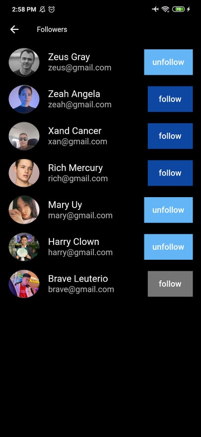
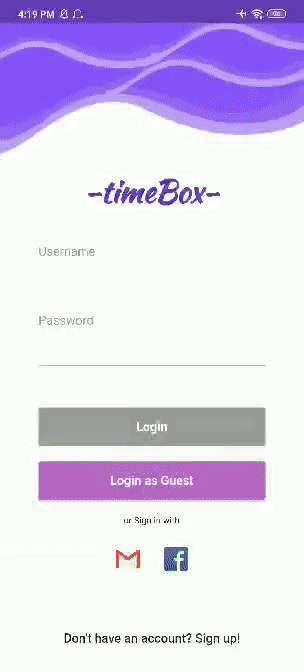
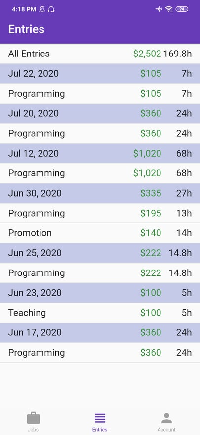
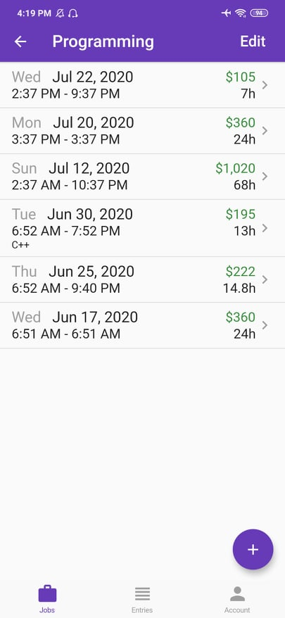

&nbsp;&nbsp;&nbsp;&nbsp;&nbsp;&nbsp;&nbsp;&nbsp;&nbsp;

# Tinkler
Tinkler is social media app which is also built with flutter with light and dark mode. With this app, users can express themselves and update their followers about their day in different ways. Users can search and follow each other while also chat their friends, post, like, comment and customize their profile. Users can use their facebook to login or create an account.

I'm extremely pleased with how the project came out and it also really opened my eyes how much effort developers give to build these kinds of app. At first i thought that this would be small app, but when i started builting it, it is not easy as it seems which i really enjoy because it means i am learning.  I used a new architecture for the app which is very similar to MVVM called Stacked Architecture and with it my development process become much better and i was able to seperate concerns much better.

&nbsp;&nbsp;&nbsp;&nbsp;&nbsp;&nbsp;&nbsp;&nbsp;&nbsp;&nbsp;

# Time-Box
Timebox is a flutter job/time tracker app which is also available for both ios and android devices. I built this so that i would be able to practice different kind of login, especially facebook and gmail which are both used largely by many people. With this app you can put your taks and job, put sub tasks inside, and you can also check all of the subtasks in entries page which calculates the total of earn money based on time and rate.

I'm very happy while building it, i used blocs with react to combine two streams of data and also conducted unit and widget tests and used mockito for easier testing. For login, and saving the data i used firebase for it. It is built in vscode and is written entirely with dart and flutter.

&nbsp;&nbsp;&nbsp;&nbsp;&nbsp;&nbsp;&nbsp;&nbsp;&nbsp;&nbsp;

<!-- &nbsp;&nbsp;&nbsp;&nbsp;&nbsp;&nbsp;&nbsp;&nbsp;&nbsp;&nbsp; -->

## Thanks for stopping by! 
<i>To check more please check my repository! I built over 40+ mobile apps! :)</i>

# Contact Info:

- Email: romleuterio@gmail.com
- LinkedIn: [braveleuterio](https://www.linkedin.com/in/carymiller/)
- Twitter: [@braveleuterio](https://twitter.com/carycodes)
