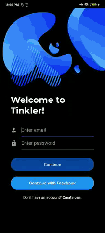
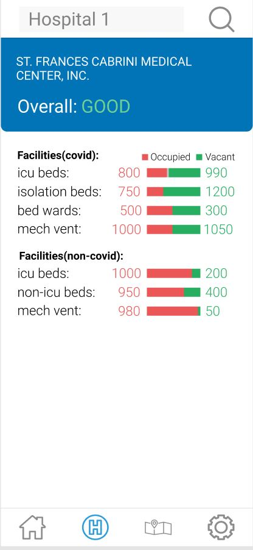

<!-- &nbsp;&nbsp;&nbsp;&nbsp;&nbsp;&nbsp;&nbsp;&nbsp;&nbsp; -->

&nbsp;&nbsp;&nbsp;&nbsp;&nbsp;&nbsp;&nbsp;&nbsp;&nbsp;

###### Note: Still working on the links of the shields 

# Bizz
Bizz is e-commerce app which is built with flutter and dart. This is an app where users can quickly buy clothes that they 
like in seconds. Users can also start their own shop and sell their clothes buy becoming a seller member. The users will be able to shop freely and easily with the app's minimalistic design and color.

This project is still in progress, at the present i just have finished the UI part. I am currently learning mongoDB and how it can be connected to flutter applications. With this, i would be able to improve my development skills. I am also planning to use stripe as the payment gateaway in the future.

&nbsp;&nbsp;&nbsp;&nbsp;&nbsp;&nbsp;&nbsp;&nbsp;&nbsp;&nbsp;

# Tinkler
Tinkler is social media app which is also built with flutter with light and dark mode. With this app, users can express themselves and update their followers about their day in different ways. Users can search and follow each other while also chat their friends, post, like, comment and customize their profile. Users can use their facebook to login or create an account.

I'm extremely pleased with how the project came out and it also really opened my eyes how much effort developers give to build these kinds of app. At first, i thought that this would be small app, but when i started builting it, it is not easy as it seems but at the same, i really enjoyed it because it means i am learning.  I used a new architecture for the app which is very similar to MVVM called Stacked Architecture and with it my development process become much better and i was able to seperate concerns much better.

&nbsp;&nbsp;&nbsp;&nbsp;&nbsp;&nbsp;&nbsp;&nbsp;&nbsp;&nbsp;

# Time-Box
Timebox is a flutter job/time tracker app which is also available for both ios and android devices. I built this so that i would be able to practice different kinds of login, especially facebook and gmail which are both used largely by many people. With this app you can put your job, its tasks and their subtasks and check all of the them in entries page which includes the summary of them and calculates the total of earned money based on time and rate.

I'm very happy while building it, i used blocs with react to combine two streams of data and also conducted unit and widget tests and used mockito for easier testing. For login and storing the data, i used firebase for it. It is built in vscode and is written entirely with dart and flutter.

&nbsp;&nbsp;&nbsp;&nbsp;&nbsp;&nbsp;&nbsp;&nbsp;&nbsp;&nbsp;

# Covid-PH
A mobile application where users can check the latest statistics of cases using a covid API based on the data of
DOH PH. An important feature of this app is that users can search hospitals and
check their current facilities if they have vacancies or not for both covid and non-covid patients.

This app is a collaboration between me and my batchmate @DoggoDev which is the one who also made the api. While doing this application, i learned a lot of things that companies do. I would say that our collaboration is great because we always talk what to do in slack. We also used github for uploading changes and github actions for continuous integration. While making this app, we keep the SOLID principles in mind, and we strictly followed it. We also made it maintainable by using architecture and adding mock tests. I am mainly responsible in backend, and he is mainly responsible in frontend. In the present, we are in the final phase which is the map screen.

&nbsp;&nbsp;&nbsp;&nbsp;&nbsp;&nbsp;&nbsp;&nbsp;&nbsp;&nbsp;

<!-- &nbsp;&nbsp;&nbsp;&nbsp;&nbsp;&nbsp;&nbsp;&nbsp;&nbsp;&nbsp; -->

## Thanks for stopping by! 
<i>To check more please check my repository! I built over 40+ mobile apps! :)</i>

# Contact Info:

- Email: romleuterio@gmail.com
<!-- - LinkedIn: [braveleuterio](https://www.linkedin.com/in/carymiller/) -->
- Twitter: [@braveleuterio](https://twitter.com/carycodes)
